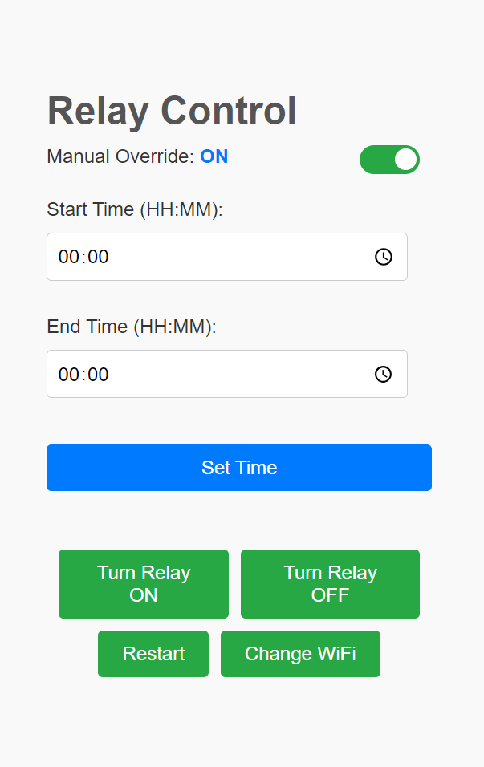

# ESP1 Relay Project
A simple ESP-01 project to switch devices ON and OFF on a schedule, controlled via Wi-Fi.

## Features
- WiFi configuration portal when not connected to any network.
- Time scheduling with start and end times.
- Manual override toggle for relay control.
- Automatic time synchronization using NTP.

## Hardware
- ESP8266 NodeMCU 0.1 (ESP-12)
- Relay module 
- ESP-01 Programmer

## Typical Circuit

## Prerequisites
- Arduino IDE or compatible environment.
- Install the "Preferences" library (e.g., through Arduino Library Manager).

## How to Flash
1. Download the [esp1_relay.ino](https://github.com/Sarin-jacob/Esp01-WiFi-Relay/releases/download/v1.0/esp1_relay.ino) file.
2. Connect the ESP-01 to your computer via USB with ESP-01 Programmer.
3. Open the `esp1_relay.ino` file in the Arduino IDE 
4. Select the appropriate board (e.g., "NodeMCU 1.0 (ESP-12E Module)") and COM port.
5. click "Upload."

## Screenshots

Show screenshots

## Usage
When powered on, After 5 seconds, the device creates an AP named "sprinkler" by default. This name depends on the `Rname` variable in **esp1_relay.ino.** 
Then wifi can be configured by going to http:// `Rname` .local/. or http://192.168.4.1/ .
Once WiFi is configured, you can manage the relay at http://sprinkler.local/ or http:// `Rname` .local/.
If You dont have WiFi, You can connect to `Rname` AP and visiting http://sprinkler.local/con or http://192.168.4.1/con . 

## Customizing Rname
You can change the `Rname` variable in **esp1_relay.ino** to modify the soft AP name and mDNS host name, before uploading the code. 

